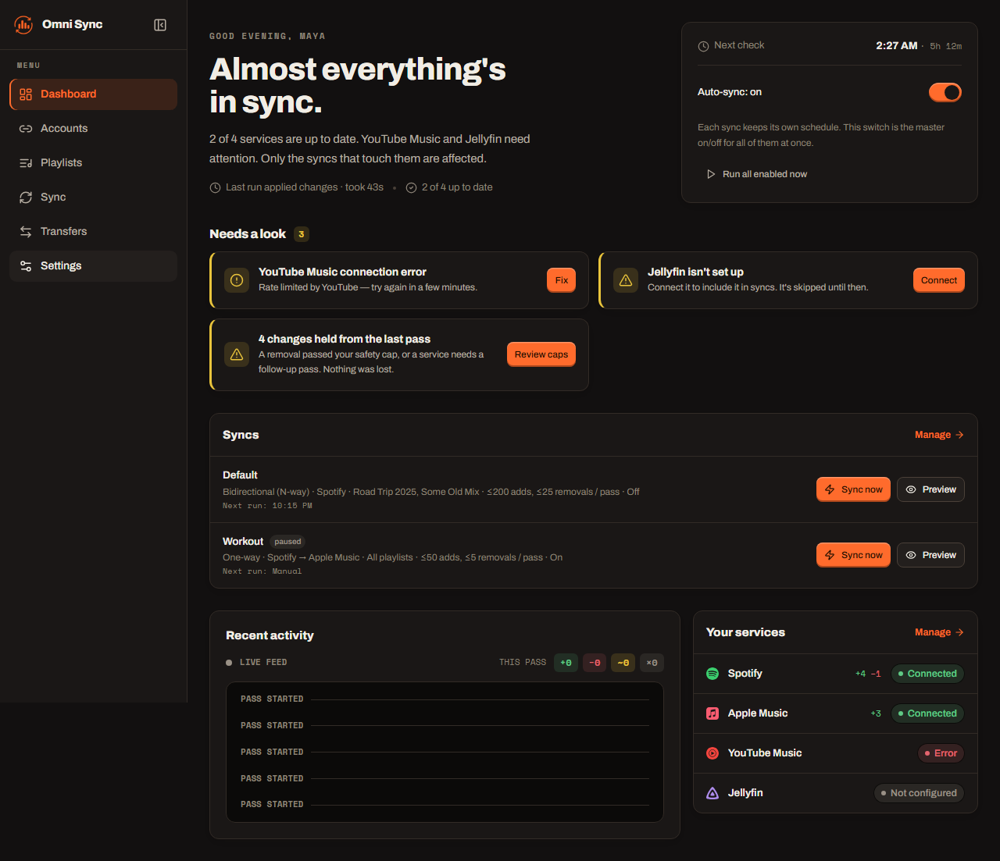
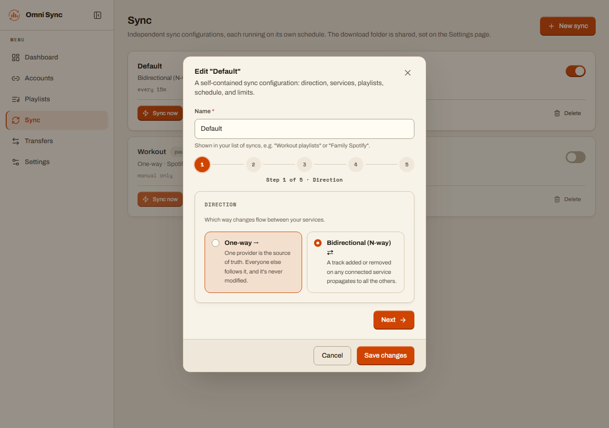
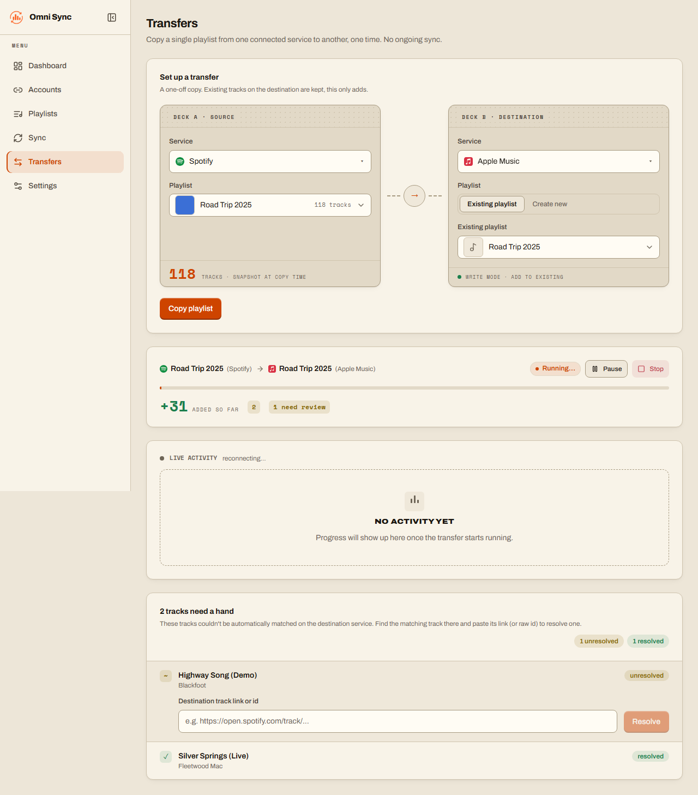
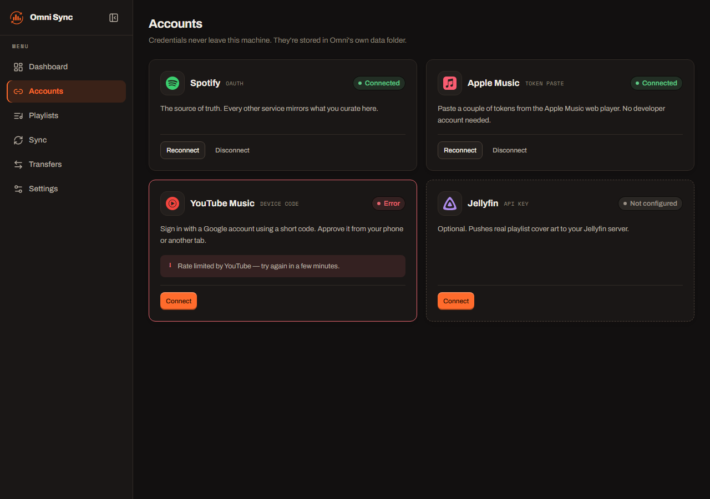
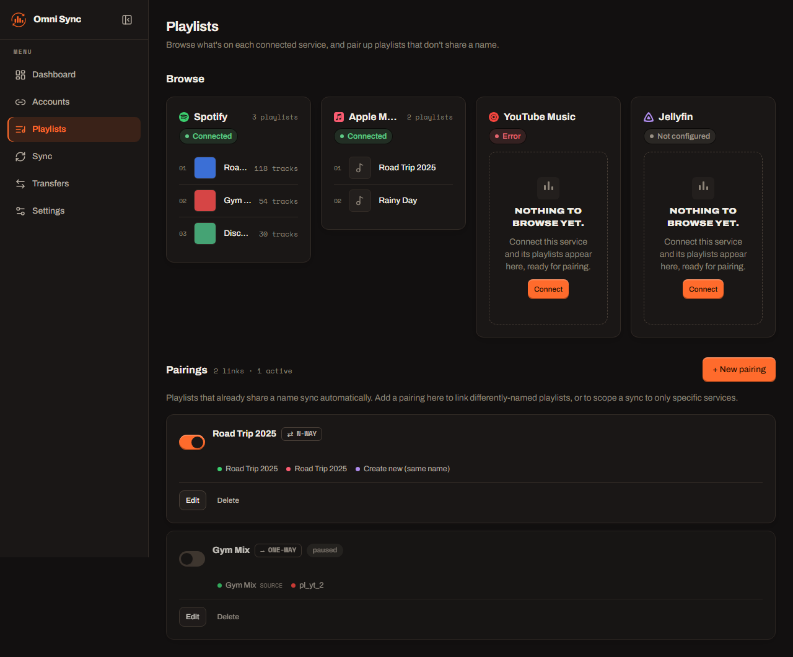

<div align="center"><a name="readme-top"></a>

<picture>
  <source media="(prefers-color-scheme: dark)" srcset="./.github/assets/wordmark-dark.png">
  
</picture>

# Omni Playlist Sync

Self-hosted, always-on **playlist sync for Spotify, Apple Music, and YouTube Music** — plus a local, Jellyfin-ready audio mirror.<br/>
A free, open-source, **self-hosted alternative to Soundiiz, TuneMyMusic, and FreeYourMusic** that _you_ own and run.

**One-way mirror or full bidirectional (N-way) sync · one-off playlist transfers · ISRC-accurate matching · all from your browser**

[Quick Start](#-quick-start) · [Features](#-features) · [Screenshots](#-screenshots) · [Docker](#-always-running-docker) · [How it works](#-how-it-works) · [Report Bug][github-issues-link] · [Request Feature][github-issues-link]

<!-- SHIELD GROUP -->

[![CI][ci-shield]][ci-link]
[![License][license-shield]][license-link]
[![Python][python-shield]][python-link]
[![Docker][docker-shield]][docker-link]<br/>
[![Stars][stars-shield]][stars-link]
[![Forks][forks-shield]][forks-link]
[![Issues][issues-shield]][issues-link]
[![Last commit][last-commit-shield]][last-commit-link]

**Share this project**

[![][share-x-shield]][share-x-link]
[![][share-reddit-shield]][share-reddit-link]
[![][share-linkedin-shield]][share-linkedin-link]

<sup>Set it up once — every playlist you curate stays mirrored across every service, in date-added order.</sup>

<a href="./.github/assets/omni-sync-demo.mp4"></a>

<sup>▶ <a href="./.github/assets/omni-sync-demo.mp4">Watch the 1080p version</a></sup>

</div>

> [!NOTE]
> **Web app + headless CLI, one engine.** Click through a browser UI to connect services, build syncs, and transfer playlists — or run it `.env` + cron style. Both drive the same sync core.

<details>
<summary><kbd>Table of contents</kbd></summary>

#### TOC

- [✨ Features](#-features)
- [📸 Screenshots](#-screenshots)
- [🚀 Quick Start](#-quick-start)
- [🐳 Always running: Docker](#-always-running-docker)
- [⚙️ How it works](#-how-it-works)
  - [Matching](#matching)
  - [Bidirectional (N-way) sync](#bidirectional-n-way-sync)
- [💿 Local download mirror (Jellyfin)](#-local-download-mirror-jellyfin)
- [🔌 Connecting each service](#-connecting-each-service)
  - [Spotify](#spotify)
  - [Apple Music](#apple-music)
  - [YouTube Music](#youtube-music)
- [🖥️ Headless CLI](#️-headless-cli)
- [🛡️ Safety rails](#️-safety-rails)
- [🗃️ Caching &amp; song archive](#️-caching--song-archive)
- [🧱 Project layout](#-project-layout)
- [🩺 Troubleshooting](#-troubleshooting)
- [📄 License](#-license)

####

<br/>

</details>

## ✨ Features

Omni Playlist Sync keeps your playlists identical everywhere without manual re-adding, one-by-one copying, or a paid cloud service holding your library. It is **cross-platform, self-hosted, and open source**.

- 🔁 **True mirroring, not append-only** — adds _and_ removals. Choose a source of truth (Spotify by default) and the others follow it.
- ⇄ **Bidirectional N-way sync** — an add or removal on _any_ connected service propagates to all the others, echo-free, behind removal guards.
- 🎯 **ISRC-accurate matching** — exact recording identity where available, with Unicode-aware fuzzy title/artist/duration fallbacks (feat-credit drift, "- 2015 Remaster" suffixes, non-Latin scripts, video-only uploads — all handled).
- 🎛️ **Multiple named syncs** — set up as many independent syncs as you like, each with its own services, playlists, schedule, and safety caps.
- ↪️ **One-off transfers** — copy any playlist from one service to another with a live progress bar; **pause, resume, or stop** mid-copy, and manually resolve unmatched tracks.
- 🌐 **Followed playlists** — sync and transfer playlists you follow but don't own, not just ones you created.
- 💿 **Local download mirror** — keep offline audio, one folder per playlist in **Jellyfin's** `AlbumArtist/Album` layout, with covers and an auto-updated `.m3u8`.
- 🛡️ **Safety rails** — dry-run by default, per-pass add/removal caps, net-loss protection, empty-snapshot guard, fail-closed on expired tokens.
- 🗃️ **Ever-growing song archive** — every track ever seen is recorded in a local SQLite database (name, artist, album, ISRC, raw metadata, first/last seen).
- 🐳 **Runs anywhere** — one `docker compose up -d` for the browser app, or plain CLI + cron / Task Scheduler.

> [!IMPORTANT]
> **Self-hosted and private by design.** Your listening data and credentials never leave your machine. The web UI has **no login** — bind it to your LAN and don't port-forward it to the internet.

<div align="right">

[![][back-to-top]](#readme-top)

</div>

## 📸 Screenshots

<div align="center">

**One dashboard for every library — sync status, jobs, live activity, and service health**



**Set up any number of syncs — one-way or bidirectional — in a short wizard**



**Transfer a playlist between services, live — with pause / resume / stop and manual conflict resolution**



**Connect every service in your browser — one-click OAuth, guided token paste, or an API key**



**Browse and pair playlists across services**



</div>

<div align="right">

[![][back-to-top]](#readme-top)

</div>

## 🚀 Quick Start

The fastest way to run it is Docker — the container serves the web UI and runs your syncs on schedule.

```bash
git clone https://github.com/ahnafnafee/omni-playlist-sync.git
cd omni-playlist-sync
docker compose up -d
```

Then open **`http://localhost:8888`** and connect your services in the browser. That's it — **no `.env` to edit**; everything is configured in the UI and saved under `./data`.

Prefer running it without Docker?

```bash
uv sync
uv run uvicorn omni_sync.web:app --host 0.0.0.0 --port 8080   # then open http://127.0.0.1:8080
```

> Requires [`uv`](https://docs.astral.sh/uv/) (Python 3.13+). For the local download mirror, also `uv tool install spotdl` and have `ffmpeg` on PATH.

<div align="right">

[![][back-to-top]](#readme-top)

</div>

## 🐳 Always running: Docker

The Docker container is the recommended deployment: it serves the web UI, runs your syncs on their schedules, and restarts with the host. It runs as **`omni-playlist-sync`** and persists all auth + caches in `./data`.

```bash
docker compose up -d --build     # build + start in the background
# open http://<host>:8888 and connect your services + create syncs in the browser
docker compose logs -f           # watch it work
```

**No `.env` is needed to start** — everything is configured in the browser and saved under `./data`. Connect Spotify / YouTube Music with one-click OAuth (the wizard shows the exact redirect URI to whitelist), paste your Apple Music tokens, add a Jellyfin API key — all from the Accounts page — then build your syncs on the Sync page.

| | |
| --- | --- |
| **Port** | The UI is published on host **8888** (the `8888:8080` mapping in `docker-compose.yml`; change the host side if it clashes). **LAN-only** — don't port-forward it to the internet; the UI has no login yet. |
| **Persistence** | `./data` holds credentials, tokens, caches, and the song archive. Back it up to keep your setup across rebuilds. |
| **Downloads** | Set `DOWNLOAD_DIR` (in `.env` or your shell) to your host music dir (e.g. `F:\Torrent\Music`); compose bind-mounts it to `/music`. From Docker, set `JELLYFIN_URL` to `http://host.docker.internal:8096`. |
| **Expired Apple tokens** | Re-paste them on the Accounts page; no restart needed. |

<div align="right">

[![][back-to-top]](#readme-top)

</div>

## ⚙️ How it works

Every pass, for each selected playlist name that exists on the source:

1. Snapshot the source playlist (tracks, ISRCs, added-at dates).
2. Reconcile the same-named playlist on each target — Apple Music (via the web player's amp-api) and YouTube Music (via the official [YouTube Data API v3](https://developers.google.com/youtube/v3)) — concurrently.
3. Missing tracks are resolved (cached links → ISRC → scored search) and appended oldest-first; tracks gone from the source are removed behind guards.
4. Optionally, [spotDL](https://github.com/spotDL/spotify-downloader) syncs a local audio folder per playlist.

The default source of truth is Spotify, but **one-way mode is provider-agnostic** — Apple Music or YouTube Music can be the source instead.

### Matching

Same hierarchy the cross-service tools use ([TuneLink](https://tommcfarlin.com/case-study-tunelink-matching-music-ai/), MusicBrainz): **hard identifier → search → fuzzy score**.

1. **Cached link** — once a source track is matched to a target's catalog id / video id, that link is stored and reused (immune to title drift).
2. **ISRC** — exact recording identity where the service exposes it.
3. **Scored search** — [RapidFuzz](https://rapidfuzz.com/) `token_set_ratio` + Jaro-Winkler, over both the raw and **romanized** ([anyascii](https://github.com/anyascii/anyascii)) title and artist, anchored by duration. This handles, without hardcoding:
   - **Multi-artist credits** — one service lists every feature, another lists the primary (`Arijit Singh, Ved Sharma, …` ↔ `Arijit Singh`).
   - **Title decoration** — `(feat. …)`, `- 2015 Remaster`, `(From "…")`, extra "Official Music Video" suffixes.
   - **Transliteration** — Cyrillic / Bengali / Greek / Arabic (`Камин` ↔ `Kamin`, `নেশার বোঝা` ↔ `Neshar Bojha`).
   - **Video-only tracks** — YouTube search falls back to the `videos` filter for indie/OST tracks that live on YT only as uploads.

The **duration anchor** unlocks the looser title match, so a different version (`Runaway - Piano Version`) or a wrong-artist cover isn't accepted when its length disagrees. Tracks with no confident match are reported and skipped.

### Bidirectional (N-way) sync

By default one provider is the source of truth and edits flow one way. In **N-way mode** every provider is a peer: add or remove a track on Spotify, Apple Music, _or_ YouTube Music and the change propagates to the others.

Bidirectional sync is impossible statelessly, so each logical playlist's canonical membership is snapshotted after every clean pass. Each pass diffs every provider against that snapshot, unions the changes, and reconciles everyone to the result:

- **Echo-free** — a propagated add becomes part of the snapshot, so it's never bounced back.
- **Add-wins** on conflict — losing a song is worse than keeping an extra one.
- **Read-collapse guard** — if a provider suddenly reads far fewer tracks than the baseline (a transient API hiccup), it's skipped that pass so one bad read can't cascade a mass-delete.
- **Same rails as one-way** — per-pass `MAX_ADDS` / `MAX_REMOVALS` caps and net-loss protection hold on every write side.

> **Always dry-run first.** Run without `--execute` (or use **Preview** in the UI) and read the plan — it prints every proposed add/remove on every provider before anything is written.

<div align="right">

[![][back-to-top]](#readme-top)

</div>

## 💿 Local download mirror (Jellyfin)

Keep an offline audio copy of each synced playlist, one folder per playlist, via [spotDL](https://github.com/spotDL/spotify-downloader). Sync is true mirroring: new tracks are downloaded, removed tracks are deleted locally. The layout is **Jellyfin-ready** — point a Jellyfin music library at the download dir and both the tracks and the playlists appear, staying updated every pass:

```text
<DOWNLOAD_DIR>/
  <Playlist>/
    <Playlist>.m3u8          # auto-(re)generated; Jellyfin imports it as a playlist
    cover.jpg                # the source playlist cover, highest resolution
    <AlbumArtist>/
      <Album>/
        Artists - Title.mp3  # tagged + cover art embedded
```

Enable it by setting `DOWNLOAD_DIR` and installing spotDL + ffmpeg:

```bash
uv tool install spotdl       # isolated CLI; or: pipx install spotdl
# ffmpeg required: winget install ffmpeg   (or: spotdl --download-ffmpeg)
```

- **Incremental** — after the first full download, only newly-added tracks are fetched; removed tracks (and their emptied album folders) are pruned. An interrupted run continues next pass.
- **Newest-first `.m3u8`** — written in date-added order, newest at the top (set `LOCAL_MIRROR_ORDER=oldest` to flip). Rebuild covers / tags / mtimes from existing files with `uv run main.py --refresh-local`.
- **Playlist covers in Jellyfin** — Jellyfin ignores a cover file next to an m3u, so set `JELLYFIN_URL` + `JELLYFIN_API_KEY` and each pass uploads the real playlist cover via the Jellyfin API.
- **Audio quality** — the source is YouTube, so without a YT Music **Premium** cookie the ceiling is ~128–160 kbps. `LOCAL_MIRROR_FORMAT=opus` keeps YouTube's native stream without an mp3 re-encode; a Premium cookie (`LOCAL_MIRROR_COOKIE_FILE`) unlocks 256 kbps AAC.

<sub>Downloading audio is for personal use of content you have access to — your call.</sub>

<div align="right">

[![][back-to-top]](#readme-top)

</div>

## 🔌 Connecting each service

In the web app, the **Accounts** page walks you through each service and shows the exact values to paste. You supply your own API app credentials once — nothing is proxied through a third party.

### Spotify

1. Create an app at <https://developer.spotify.com/dashboard> and copy its **Client ID** + **Client Secret**.
2. Add a redirect URI — the connect wizard shows the exact one, e.g. `http://127.0.0.1:8888/oauth/spotify/callback` (Docker) or `http://127.0.0.1:8080/oauth/spotify/callback` (direct run). Spotify only allows an `http` redirect on the loopback IP, so authorize via `http://127.0.0.1:<port>`, not a LAN IP.

The web UI requests read + write scopes up front (Spotify is a write target in N-way syncs and reverse transfers). The CLI reads Spotify read-only in one-way mode.

### Apple Music

No Apple Developer account needed — two headers from `music.apple.com` are enough. Open <https://music.apple.com>, sign in, open DevTools → **Network**, play a song, filter for `amp-api.music.apple.com`, and from any request's headers copy:

- `authorization: Bearer eyJ...` → **Bearer token** (the `eyJ...` part, without `Bearer `)
- `media-user-token: ...` → **User token** (full value)

The connect wizard lets you paste the raw headers and parses the values for you. Tokens last months; re-paste them on the Accounts page when they expire.

### YouTube Music

Talks to the **official [YouTube Data API v3](https://developers.google.com/youtube/v3)**, whose OAuth refresh token is durable and survives restarts.

1. In the [Google Cloud console](https://console.cloud.google.com), create a project, enable **YouTube Data API v3**, and create an OAuth client of type **TVs and Limited Input devices**.
2. On the **OAuth consent screen**, set **Publishing status → In production** (leaving it in "Testing" expires the token after 7 days).
3. In the app, paste the client ID + secret and complete the on-screen device code.

> **Quota**: the Data API allows 10,000 units/day (a search costs 100, an add/remove 50). Steady-state upkeep is cheap; a big first-time backlog can hit the cap and resume the next day.

<div align="right">

[![][back-to-top]](#readme-top)

</div>

## 🖥️ Headless CLI

Prefer `.env` + cron / Task Scheduler? The same engine runs headless.

```bash
uv sync
cp .env.example .env            # fill in credentials
uv run main.py                  # dry run — prints every add/remove it *would* do
uv run main.py --execute        # apply for real
```

Useful flags:

```bash
uv run main.py --execute --playlists "Aurora,Chill"   # only these pairs
uv run main.py --execute --loop --interval 15m        # run forever
uv run main.py --execute --max-removals 100           # one-off larger cleanup
```

Key env vars (see `.env.example`): `SPOTIFY_CLIENT_ID` / `SPOTIFY_CLIENT_SECRET`, `APPLE_BEARER_TOKEN` / `APPLE_USER_TOKEN`, `PLAYLISTS`, `SYNC_INTERVAL`, `MAX_ADDS` / `MAX_REMOVALS`, `DOWNLOAD_DIR`, `SYNC_MODE=nway`, `PROVIDERS`.

<div align="right">

[![][back-to-top]](#readme-top)

</div>

## 🛡️ Safety rails

Removals are destructive, so they're guarded:

- **Dry run is the default** — nothing changes without `--execute` (or the UI's real-sync action).
- If the source returns 0 tracks for a playlist the target shows as non-empty, removals are skipped that pass (a transient API failure can't empty a playlist).
- More than `MAX_REMOVALS` pending removals in one pass → removals are skipped and logged.
- More than `MAX_ADDS` pending additions → the rest continue next pass (giant one-burst backfills are what trip bot detection).
- **Net-loss protection** — a target-side track resembling a source track that has no match on that service is held, not deleted.
- Any Apple `401/403` aborts the pass immediately — no partial deletes on expired tokens.

<div align="right">

[![][back-to-top]](#readme-top)

</div>

## 🗃️ Caching &amp; song archive

Everything resolvable is cached so steady-state passes are near-instant: per-service resolve caches (ISRC + search, including misses), a `snapshot_id`-keyed track-list cache, hard identifier links in SQLite, and a per-pair snapshot-skip (`unchanged since last clean sync`).

Every pass also archives the metadata of every track it sees into `song_cache.db` — a SQLite file that only ever grows. Removed tracks stay archived with name, artist, album, duration, ISRC, raw snapshot JSON, and first/last-seen timestamps:

```bash
sqlite3 song_cache.db "SELECT name, artist, album, first_seen FROM songs ORDER BY first_seen DESC LIMIT 20"
```

<div align="right">

[![][back-to-top]](#readme-top)

</div>

## 🧱 Project layout

CLI entry: `uv run main.py` (thin shim) or `python -m omni_sync`. Web entry: `omni_sync.web:app`.

```text
omni_sync/
  engine/       # provider-agnostic sync core (no web deps): runner, matching, targets/, spotify, downloads, archive
  services/     # stateful services over the engine: accounts/ connectors, syncs, sync_service, transfers, playlists, settings
  web/          # FastAPI app: thin HTTP/SSE over services/ (routers/)
frontend/       # React + Vite SPA (built and served by the API in production)
```

**Adding a service** (Tidal, Deezer, …): subclass `MirrorTarget`, implement ~8 methods, add its builder to `engine/targets`' `_REGISTRY`, and add a matching `Connector` under `services/accounts`. All reconciliation — diff, ordering, safety rails, logging, snapshot-skip — is inherited.

<div align="right">

[![][back-to-top]](#readme-top)

</div>

## 🩺 Troubleshooting

- **`Missing required environment variable`** — fill in `.env` (CLI) or connect the service in the UI.
- **`Apple rejected … (401/403)`** — re-capture the two Apple tokens (they expire).
- **Spotify OAuth redirect mismatch** — the redirect URI in your Spotify app must exactly match the one the wizard shows (including the port).
- **A playlist isn't syncing** — confirm it's in the sync's playlist scope and exists on the source (targets are auto-created on a real pass).

<div align="right">

[![][back-to-top]](#readme-top)

</div>

## ⭐ Star history

[](https://star-history.com/#ahnafnafee/omni-playlist-sync&Date)

## 📄 License

Copyright © 2026 [Ahnaf An Nafee](https://github.com/ahnafnafee).<br/>
This project is [MIT](./LICENSE) licensed.

<!-- LINK GROUP -->

[back-to-top]: https://img.shields.io/badge/-BACK_TO_TOP-151515?style=flat-square
[ci-shield]: https://img.shields.io/github/actions/workflow/status/ahnafnafee/omni-playlist-sync/ci.yml?branch=main&label=CI&labelColor=black&logo=githubactions&logoColor=white&style=flat-square
[ci-link]: https://github.com/ahnafnafee/omni-playlist-sync/actions/workflows/ci.yml
[license-shield]: https://img.shields.io/github/license/ahnafnafee/omni-playlist-sync?color=F2601A&labelColor=black&style=flat-square
[license-link]: https://github.com/ahnafnafee/omni-playlist-sync/blob/main/LICENSE
[python-shield]: https://img.shields.io/badge/python-3.13%2B-F2601A?labelColor=black&logo=python&logoColor=white&style=flat-square
[python-link]: https://www.python.org/
[docker-shield]: https://img.shields.io/badge/docker-ready-F2601A?labelColor=black&logo=docker&logoColor=white&style=flat-square
[docker-link]: https://github.com/ahnafnafee/omni-playlist-sync/blob/main/docker-compose.yml
[stars-shield]: https://img.shields.io/github/stars/ahnafnafee/omni-playlist-sync?color=F2601A&labelColor=black&logo=github&logoColor=white&style=flat-square
[stars-link]: https://github.com/ahnafnafee/omni-playlist-sync/stargazers
[forks-shield]: https://img.shields.io/github/forks/ahnafnafee/omni-playlist-sync?color=F2601A&labelColor=black&logo=github&logoColor=white&style=flat-square
[forks-link]: https://github.com/ahnafnafee/omni-playlist-sync/network/members
[issues-shield]: https://img.shields.io/github/issues/ahnafnafee/omni-playlist-sync?color=F2601A&labelColor=black&logo=github&logoColor=white&style=flat-square
[issues-link]: https://github.com/ahnafnafee/omni-playlist-sync/issues
[last-commit-shield]: https://img.shields.io/github/last-commit/ahnafnafee/omni-playlist-sync?color=F2601A&labelColor=black&logo=github&logoColor=white&style=flat-square
[last-commit-link]: https://github.com/ahnafnafee/omni-playlist-sync/commits/main
[github-issues-link]: https://github.com/ahnafnafee/omni-playlist-sync/issues
[share-x-shield]: https://img.shields.io/badge/-share%20on%20x-black?labelColor=black&logo=x&logoColor=white&style=flat-square
[share-x-link]: https://x.com/intent/tweet?text=Omni%20Playlist%20Sync%20%E2%80%94%20self-hosted%20playlist%20sync%20for%20Spotify%2C%20Apple%20Music%20%26%20YouTube%20Music&url=https%3A%2F%2Fgithub.com%2Fahnafnafee%2Fomni-playlist-sync
[share-reddit-shield]: https://img.shields.io/badge/-share%20on%20reddit-black?labelColor=black&logo=reddit&logoColor=white&style=flat-square
[share-reddit-link]: https://www.reddit.com/submit?title=Omni%20Playlist%20Sync%20%E2%80%94%20self-hosted%20playlist%20sync%20across%20Spotify%2C%20Apple%20Music%20%26%20YouTube%20Music&url=https%3A%2F%2Fgithub.com%2Fahnafnafee%2Fomni-playlist-sync
[share-linkedin-shield]: https://img.shields.io/badge/-share%20on%20linkedin-black?labelColor=black&logo=linkedin&logoColor=white&style=flat-square
[share-linkedin-link]: https://www.linkedin.com/sharing/share-offsite/?url=https%3A%2F%2Fgithub.com%2Fahnafnafee%2Fomni-playlist-sync
